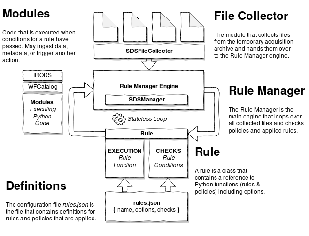

# RDSA Data Manager

This project provides two main products, an SDS policy manager, and a
generic framework to define new policy managers.

First, an SDS policy manager, launched by the script in
`sdsmanager.py`. This is an extensible policy manager, that is able to
run a sequence of policies/rules on a list of SDS daily files. Its
objective is to be easy to configure, through the configuration of the
existing rules, and also easy to extend, with the addition of new
policies.

Second, the `RuleManager` class, that is the base to the SDS manager,
but is also able to transparently apply a sequence of policies to a
collection of data items of different types, as long as the policies
accept these types.

## Schematic Overview



## Dependencies

The Rule Manager uses many data tools from IRIS that need to be compiled and
added to `$PATH`. These programs include:

- IRIS Dataselect (https://github.com/iris-edu/dataselect)
- IRIS MSRepack (https://github.com/iris-edu/libmseed)
- IRIS MSI (https://github.com/iris-edu/msi)

The source code for these packages is included in the ./lib directory and can
be automatically compiled using the installation script using:

    ./install.sh

## Testing

The rule manager engine can be tested using the `runtests.py` script included in
the `test` directory.

## Running the SDS policy manager

1) Edit the `configuration.py` file with options needed to run the script, e.g.,
the location of the files, and the information to connect to iRODS and the Mongo
database.

2) Edit your JSON rule map file specifying the options for each
rule. The rules available are the ones in `rules.sdsrules`.

3) Edit your JSON rule sequence file specifying which rules to run and in what order.

4) Run `python3 sdsmanager.py --dir /path/to/archive --rulemap rules.json --ruleseq rule_seq.json`.

## Implementing a new rule for an existing manager

Create a new top-level function in the module being used by the
manager with the following signature: `exampleRule(options,
item)`. The first argument, `options` will be a `dict` with the
options passed through the JSON rule configuration. The second
argument, `item` is the object to which the rule is applied.

For example, rules for the SDS archive are in the `sdsrules` module,
and `item` is a `SDSFile` object describing the SDS file.

To include the new `exampleRule` in the execution, add a new object to the list
in the JSON rule map, mentioning the rule, and defining its options, like so:
```
{
    "functionName": "exampleRule",
    "options": { ... }
    "conditions": [{
        "functionName": "exampleCondition",
       	"options": { ... }
    }, ...]
}
```

Note that the `"options"` and `"conditions"` attributes are mandatory, even if empty.

Once all the rules and their options are defined in the rule map, a
second JSON file, the rule sequence, defines their order. This file is
simpler and contains just one array, listing the rule names in the
order they should be run.

```
[
    "exampleRule",
    ...
]
```

## Implementing a new conditional for an existing manager

Rules are subject to conditions before being executed. These so called conditionals are
defined in rules.json and have a name like `assertQualityCondition`. The result of the operation
can be negated by adding an exclamation in front of the function name e.g. `!assertQualityCondition`.

These function names refer to conditions defined in the conditions directory and should be loaded during
the initialization of the rule manager.

## Implementing a new manager

To implement a new manager, operating on a new format of data, three
main steps are necessary:
1) Collecting data
2) Defining policies
3) Running the rule manager

### Collecting data

One option for computing a list of items to be operated is to extend
the `FileCollector` class.

This is a base class for the collection of files. The constructor
`FileCollector(path_to_dir)` returns a new `FileCollector` object with
the full filenames of all files inside the directory in a list
`self.files`.

It is possible to extend this class to develop more complex
collectors, or implement another collector entirely to use as a data
source for the manager. The only requirement is that the items are
passed in an iterable object.

### Defining policies

As mentioned above, policies (both rules and contitions) are top-level functions in a module. For
a new manager, define all the desired rules and conditions in new modules, and pass
these modules to the manager.

Then, define their options in a JSON rule map file, and their order
in a JSON rule sequence file.

### RuleManager

The `RuleManager` is responsible for running the policies. A
`RuleManager` object takes a list of policies and applies them, in
sequence, to a list of objects.

An example on how to use it:

```python
rm = RuleManager() # Initialization, sets up logging
rm.loadRules(rules_module, conditions_module, rulemap_file, ruleseq_file) # Loads the rules
rm.sequence(item_list) # Executes the sequence of rules on all items
```

The `RuleManager` only applies the policies to the items. Both the
rules and the items are entirely transparent to it. It should run as
long as the functions defining the rules accept the data type passed.
